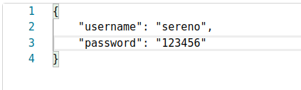
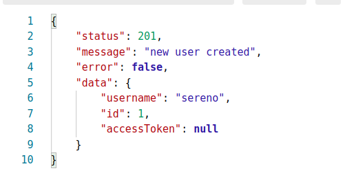
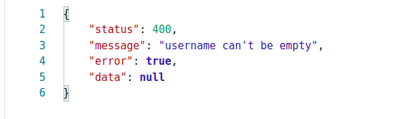
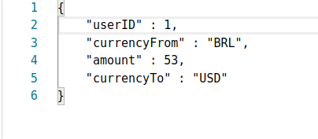
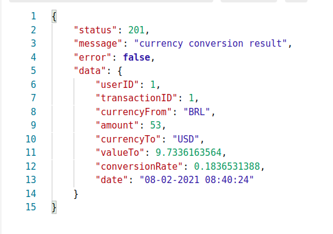
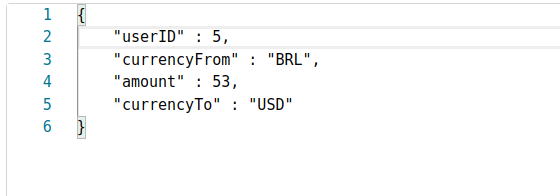
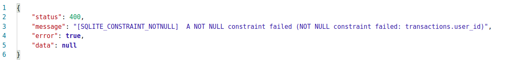

# Jaya-cc [Currency Conversion]

## GOAL

This project aims is to expose an API that does currency conversion.
To do this, we use the Exchange rates API built by the European Central Bank and hosted at https://api.exchange rates api.io.

## HOW TO USE

### Required Software

To run this project the following environment is required:

- Java 1.8 or above
- Maven
- Git

### Build Instructions

In order to build and run the application, clone this repo, enter the directory and build the jar artifact using doing the following:

```
git clone git@github.com:loquaz/jaya-currency-converter.git
cd jaya-currency-converter
mvn clean package assembly:single
```

This will produce the _target/jaya-cc-1.0-jar-with-dependencies.jar_ file.

To run the application in standalone mode just run

```
java -jar target/jaya-cc-1.0-jar-with-dependencies.jar
```

OR do the short path if you are using a \*unix like OS: clone the repo, change the _init.sh_ file mode to be executable and run the file.

```
sudo chmod u+x init.sh
./init.sh
```

## API Usage

### Endpoints

The project has the following endpoints

- POST https://jaya-currency-conversion.herokuapp.com/api/signup
- POST https://jaya-currency-conversion.herokuapp.com/api/convert
- GET https://jaya-currency-conversion.herokuapp.com/api/transactions-by-user

**/api/signup**
The signup endpoint should be used to register an new user.

- Path: /api/signup
- HTTP Method: POST
- Accepts: application/json
- Parameters:
  - username (string, required)
  - password (string, required)

Below there is a body data request example.



A succeful call produces the following output:



When something is missing (username or password), the output will be like this:



**/api/convert**
The convert endpoint do the conversion between two provided currencies.

- Path: /api/convert
- HTTP Method: POST
- Accepts: application/json
- Parameters:
  - userID (int, required)
  - currencyFrom (string, required)
  - amount (int, required)
  - currencyTo (string, required)

To make a conversion the client must send the _userID_, the original currency providing the
_currencyFrom_ field, the _amount_ to be converted and the final currency provided
in the _currencyTo_ field. All these fields are required.

Below are some example of succeful and fail requests.

Succeful conversion from 53 BRL to USD

Request:



Response:



Bad Resquest (wrong userID)

Request:



Response:



# Technical Details

**CD/CI Workflow**

The application deploy occurs everytime a push is made to the github docker branch.
This was configurated using github actions, a way to do CD/CI using the platform.
Every time new code reachs the branch, a new Job starts in a ubuntu environment that compiles, tests and package the application into a jar file.
Next, a docker image is built using this jar file and is sent to heroku, being ready to access at the https://jaya-currency-conversion.herokuapp.com domain.

**Architectural Decisions**

The application was built under the MVC design pattern, being divided into presentation and business (controller, service and data) layers.

The business layer has the following structure:

- Service: responsible by the business logic.
- Repository: Each application entity has its own repository.
- DAO: This layer was introduced to deacoplate data access.

As some persistent data could be sensitive, the data representation was splited into two:

- Entity is the datasource schema representation.
- DTO is a lightweight object carrying just needed client info.

Thinking about possible future modification, the application was designed and implemented using dependency injection.
To acomplish this goal, the google/guice IoC container was used to configure, bind and bootstrap the main classes.
